# AirDrop个人作业

>成员：徐婉婉、胥汶渲

## 一、项目简介
&emsp;&emsp;AirDrop，又称为隔空投送。是苹果公司iOS，iPadOS和macOS系统下特有的功能，用于在多台设备之间分享文件，只要将文件拖动到使用隔空投送功能的好友的头像上，就能进行一对一的文件传输（类似于无线网络传输）。综上，苹果系统中该功能能够非常方便的进行文件传输，本项目对其进行模仿，通过编写一个软件或网站充当服务器，当手机和它处于同一个局域网时，能够上传文件。同时，进一步实现在手机端复制文字，能够在电脑端进行粘贴的共享剪切板功能。
## 二、文件传输功能实现

### 2.1 基于Websocket实现

#### 2.1.1 WebSocket简介
&emsp;&emsp;随着HTML5的诞生，WebSocket协议被提出，它实现了浏览器与服务器的全双工通讯，扩展了浏览器与服务端的通讯功能，使服务端也能主动向客户端发送数据。

#### 2.1.2 WebSocket工作流程

&emsp;&emsp;浏览器经过JavaScript向服务端发出创建WebSocket链接的请求，在WebSocket链接创建成功后，客户端和服务端就能够经过 TCP链接传输数据。在webSocket API中，浏览器和服务器只需要完成一次握手，两者之间就直接可以创建持久性的连接，并进行双向数据传输。

#### 2.1.3 不同Web通信技术对比
- 轮询

        （1）介绍：轮询是最原始的实现实时Web应用的解决方案。轮询技术要求客户端以设定的时间间隔周期性地向服务端发送请求，频繁地查询是否有新的数据改动。
        （2）优点：后端编写程序较容易。
         显然，该种方法会致使过多没必要要的请求，浪费流量和服务器资源。

- Comet技术

        （1）介绍：Comet技术又能够分为长轮询和流技术。长轮询改进了上述的轮询技术，减少了无用的请求，它会为某些数据设定过时时间，当数据过时后才会向服务端发送请求。这种机制适合数据的改动不是特别频繁的状况；流技术一般是指客户端使用一个隐藏的窗口与服务端创建一个HTTP长链接，即发起HTTP 请求，创建一个TCP连接，当前HTTP 的请求发送并接收完，TCP 连接并不关闭，如果还有请求，可以直接在这个TCP连接上继续发送（不需要经过三次握手，四次挥手的连接消耗），同时，服务端会不断更新连接状态以保持HTTP长链接存活，从而实现服务端就能够经过这条长连接主动将数据发送给客户端；
        （2）优点：减少服务端和客户端的连接数，消息即时到达，没有无用请求。
        （3）缺点：当客户端越来越多时，服务器压力较大，即在大并发环境下，对服务端的性能有一定要求。

- WebSocket

        对比：Websocket是基于TCP的协议，使得客户端和服务器之间的数据交换变得更加简单，允许服务端主动向客户端推送数据。在 WebSocket API 中，浏览器和服务器只需要完成一次握手，两者之间就直接可以创建持久性的连接，并进行双向数据传输。（更好的代替轮询和长连接）

### 2.2 使用方法

- 首先，确保手机与电脑在同一局域网下，使用 Idea 打开该项目，进行相关配置后，开启 Tomcat 服务器；

- 打开命令行窗口，查看使用 `ipconfig` 命令查看电脑此时的IPv4地址，在手机的浏览器中输入网址 `http://XXX.XXX.XXX.XXX/UploadFileWebSocket/upload/uploadFile.html` 访问网页，从而实现在手机端上传文件至电脑端，其中 `XXX.XXX.XXX.XXX` 即为刚刚获得的电脑的 IP 地址，同时，需将前端uploadFile.html文件中的websocket连接地址`ws://XXX.XXX.XXX.XXX:8080/UploadFileWebSocket/upload/`中的`XXX.XXX.XXX.XXX` 替换为电脑的IP地址，注意不能用localhost，否则手机将无法成功连接服务器

- 进入具体页面后，将自动开启与服务器的websocket连接，在该页面中，用户能够根据需求开启或关闭与服务器的连接：

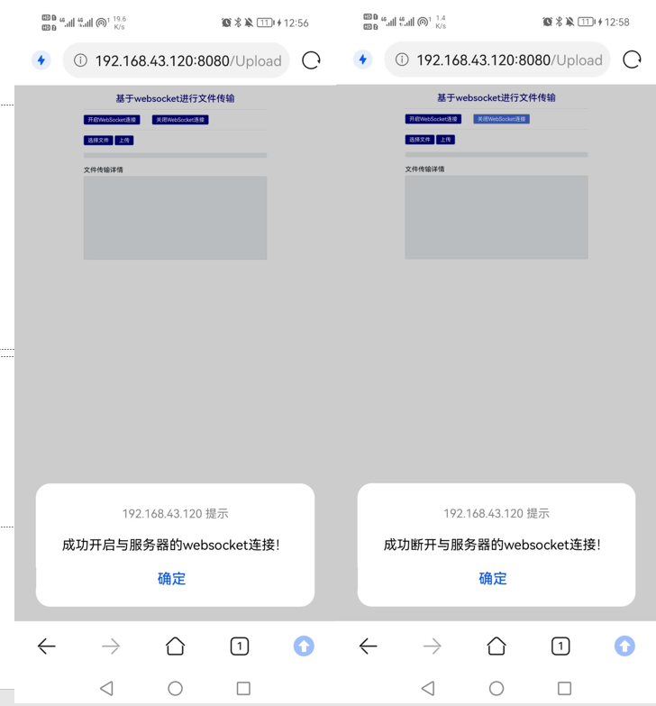

- 其中，当手机端已于服务器取得连接时不可重复开启：

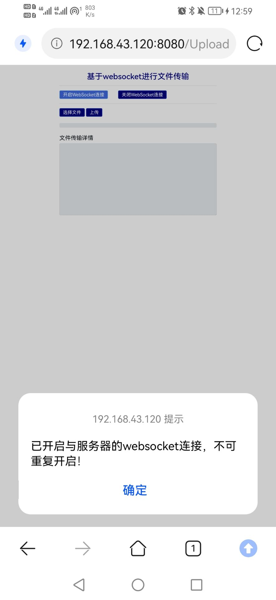

- 选择文件后，点击上传，页面将通过进度条显示文件的传输进度，同时在下方文本框内输出文件大小，电脑端（服务器）文件保存地址等详细信息，存在项目所在盘符的根路径下的日期格式目录下：

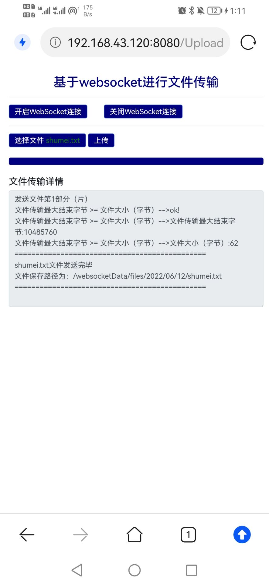

- 电脑端（服务器端）保存路径：

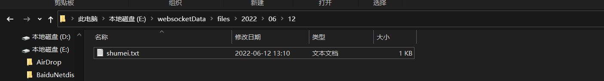

### 2.3 关键代码注解

#### 2.3.1 后端核心代码

&emsp;&emsp;这里，后端java代码中我们创建了一个`uploadFileWebSocketServer`类，该类中包含的成员变量及方法如下，其中，后台的核心代码主要是接收字节流和json消息（我们将字符串消息格式化成了json消息），主要对应两个重载方法onMessage：
- 成员变量：

        LOG：当前类的日志对象
        onlineCount：静态变量，用来记录当前在线连接数。应该把它设计成线程安全的，初始取值为0。
        webSocketSet：concurrent包的线程安全集合，用来存放每个客户端对应的uploadFileWebSocketServer对象。
        session：与某个客户端的连接会话，需要通过它来给客户端发送数据。
        docUrl：HashMap类型，用于存放电脑端的文件保存路径，保证文件对象和文件路径的唯一性
        endupload：字符串类型，文件传输结束标识，取值为“over”

- 方法：

        onOpen：自动调用，类似于事件触发，含义是连接建立成功时调用的方法，如调用addOnlineCount方法，增加1个成员变量在线连接数。
        onClose：自动调用，类似于事件触发，含义是连接关闭时调用的方法，调用subOnlineCount方法，减少1个成员变量在线连接数。
        onMessage：自动调用，类似于事件触发，此外，该方法为重载方法，是文件传输功能实现中的核心方法，我们将在下文中详细阐述。
        sendMessage：服务器主动的推送消息。
        addOnlineCount：原子性的自增操作，当新连接加入时，成员变量在线连接数onlineCount加1。
        subOnlineCount：原子性的自减操作，当一条连接断开时，成员变量在线连接数onlineCount减1。

- 核心方法onMessage(String message, String sid)：

        代码如下：

        @OnMessage
        public void onMessage(String message, @PathParam("sid") String sid) {

            JSONObject jsonObject = JSON.parseObject(message);
            System.out.println(jsonObject);
            String type = jsonObject.getString("type");
            String data = jsonObject.getString("data");
            //判断类型是否为文件名
            if ("fileName".equals(type)) {
                LOG.info("传输文件为:" + data);
                System.out.println(data);
                try {
                    HashMap<String, Object> map = new HashMap<>();
                    Date date = new Date();                              //根据时间生成文件夹路径
                    SimpleDateFormat simpleDateFormat = new SimpleDateFormat("yyyy/MM/dd");
                    String DocUrl = simpleDateFormat.format(date);
                    String path = "/websocketData/files/" + DocUrl;      //文件保存地址
                    File dest = new File(path+"/" +data);                //创建文件
                    if (dest.getParentFile().exists()) {                 //如果文件已经存在就先删除掉
                        dest.delete();
                    }
                    map.put("dest", dest);
                    map.put("path", path+"/" + data);
                    map.put("nginxPath","/"+DocUrl+"/"+data);
                    docUrl = (HashMap) map;
                    this.sendMessage("ok");

                } catch (IOException e) {
                    e.printStackTrace();
                }
            }
            else if ("fileCount".equals(type)){
                    LOG.info("传输第"+data+"份");
            }
            //判断是否结束
            else if (endupload.equals(type)) {
                LOG.info("===============>传输成功");
                String path = (String) docUrl.get("path");             //返回电脑端文件保存地址
                try {
                    this.sendMessage(path);
                } catch (IOException e) {
                    e.printStackTrace();
                }
            }
        }

        注解：

        该方法为接收客户端发送的消息时调用的方法，接收的字符串消息message为json字符串，sid为房间号。其中，json字符串参数message包含两个键，分别为type和data，从方法代码我们可以看出，根据message变量type键的取值不同，方法进行不同的逻辑业务处理，当type取值为“fileName”时，其对应data的取值为上传的文件名，此时方法会在指定的路径下创建同名文件，并保存相关路径（文件对象）；当type取值为“fileCount”时，其对应data的取值为上传文件第几部分，只需在日志对象中记录相关信息即可，这是由于对于大文件，我们这里实施分片传输；当type取值为“over”时，表示文件传输结束。

- 核心方法onMessage(byte[] message, Session session)：

        代码如下：

        @OnMessage
        public void onMessage(byte[] message, Session session) {
            try {
                FileOutputStream fstream = null;
                File file = (File) docUrl.get("dest");                //从map中获取file对象
                if (!file.getParentFile().exists()) {                 //判断路径是否存在，不存在就创建
                    file.getParentFile().mkdirs();
                }
                try {
                    fstream = new FileOutputStream(file, true);
                    fstream.write(message);
                } catch (Exception e) {
                    e.printStackTrace();
                } finally {
                    if (fstream != null) {
                        try {
                            fstream.close();
                        } catch (IOException e1) {
                            e1.printStackTrace();
                        }
                    }
                }
                this.sendMessage("ok");
            } catch (IOException e) {
                e.printStackTrace();
            }
        }

        注解：

        该方法用于接收字节流数组，用于保存从前端获取的字节流文件。已知对于大文件，我们采用分片传输，这里规定最大的传输字节数为10485760字节，方法接收到的参数message即为文件的字节流数组，这里，方法将文件的字节流数组存放如指定的文件对象中，通常情况下，该文件对象在onMessage(String message, String sid)中已创建。

#### 2.3.2 前端核心代码

&emsp;&emsp;根据文件传输页面可知，该html网页中共包含开启服务器连接、关闭连接、选择文件、上传文件四个功能按钮，这里，他们分别对应openWebSocket、closeWebSocket、fileOnchange及uploadFileFun四个函数，在html文件中，上述函数均基于javaScript实现，详细介绍如下：

- openWebSocket：

        开启服务器连接函数，受篇幅影响，这里不再展示相关代码，具体代码见uploadFile.html文件，在创建新的服务器连接之前，我们需要判断是否已存在连接，即需要避免重复连接。

- closeWebSocket：

        断开服务器连接函数，函数中仅包含两条语句，首先WebSocket实例对象调用close()函数关闭连接，其次，将WebSocket实例对象赋空，方便在创建连接是判断是否存在重复连接。其次，这里使用window.onbeforeunload()监听窗口关闭事件，当窗口关闭时，主动去关闭websocket连接，防止连接还没断开就关闭窗口，避免server端抛出异常。

- fileOnchange：

        监听file域对象的变化，然后用于回显文件名

- uploadFileFun：

        该函数为文件上传核心代码，在点击上传按钮后调用该函数，我们使用Json字符串保存文件名，通过WebSocket实例对象调用send()将字符串消息发送给后台，后台接收到文件名以后会正式开始传输文件，此时调用onMessage(String message, String sid)重载方法进行文件创建等工作；接下来，在规定的一次传输的最大字节流范围内读取文件数据，并将其以字节流的形式发送给后端的onMessage(byte[] message, Session session)保存。

### 2.4 单元测试

#### 2.4.1 单元测试介绍

&emsp;&emsp;JUnit单元测试框架由Erich Gamma和Kent Beck编写的一个回归测试框架（Regresion Testing Framework），主要用于Java语言程序的单元测试，目前使用的主流版本是JUnit以上版本，本项目基于Junit5进行单元测试。

&emsp;&emsp;我们对`uploadFileWebSocketServer`类中的关键方法进行测试，这里以onOpen()、onMessage()、addOnlineCount()、subOnlineCount()成员方法为例：

- setUp()：

        @BeforeEach
        void setUp() {
            this.fileWebSocket = new uploadFileWebSocketServer();
        }

- tearDown():

        @AfterEach
        void tearDown() {
            this.fileWebSocket = null;
        }


        其中，还包含两个标记为@BeforeEach和@AfterEach的方法，它们会在运行每个@Test方法前后自动运行，通过@BeforeEach来初始化uploadFileWebSocket类型变量fileWebSocket，通过@AfterEach来清理资源。

- onOpen():

        （1）代码：

        @Test
        void onOpen() throws Exception {
            assertEquals("success!", fileWebSocket.onOpen(null, "iufhjwhef1"));
        }

        （2）注解：

        这里，为了更加清晰的测试相关方法，我们在`uploadFileWebSocketServer`类中的onOpen()函数末尾返回int类型常量0，即若方法能够成功执行，将返回0。

        （3）运行结果展示：

    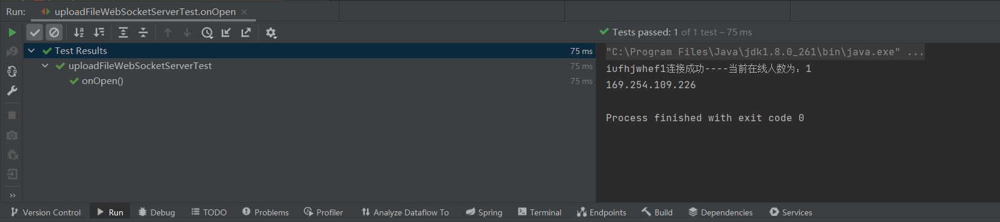


- onMessage(String message, String sid):

        （1）代码：

        @Test
        void onMessage() {
            String filejson = "{\"data\":1,\"type\":\"fileCount\"}";
            assertEquals("success!", fileWebSocket.onMessage(filejson, "iufhjwhef1"));
        }

        （2）注解：

        和onOpen方法一致，若方法成功后将获取返回值0，这里可以传送不同的Json字符串，有上文关键代码详解可知，当Json字符串中的type键取不同取值时，函数将执行不同的处理逻辑，这里以type取值为“fileCount”为例，其对应data的取值为上传文件第1部分，还可以增加type取值为“fileName”或“over”，对代码进行更加全面的测试。

        （3）运行结果展示：

    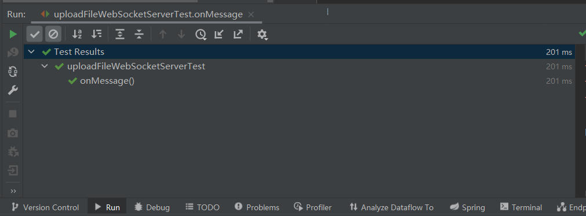

- addOnlineCount():

        （1）代码：

        @Test
        void addOnlineCount() {
            fileWebSocket.addOnlineCount();
            assertEquals(1, fileWebSocket.onlineCount);
        }

        （2）注解：
        addOnlineCount()方法与subOnlineCount()方法类似，为对成员变量onlineCount的自增和自减的原子性操作，因此，这里调用addOnlineCount()方法后，onlineCount变量将由初始的0变为1。

        （3）运行结果展示：

    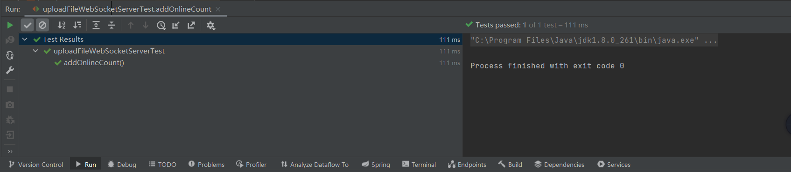
## 三、Clipboard共享
### 3.1基于socket实现  
        &emsp;&emsp;该部分基于socket通信实现，以服务端和客户端处于**同一局域网**下为前提，由服务器端建立Socket通信，等待客户端的连接请求，客户端与服务端**建立Socket连接后**，客户端复制手机任意内容，客户端的Android软件获取手机剪切板的复制内容，并发送至服务器端，服务器端接收客户端发送的数据，并设置到系统剪切板，可以直接对客户端传来的数据进行粘贴，实现了**Clipboard共享**。
### 3.2使用教程
- 服务器端      
运行ClipboardServer.java文件，启动服务器；将显示当前服务器端的IP地址，并等待客户端的连接请求
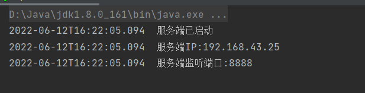
- 客户端  
（1）安装Clipboard共享Android软件  
（2）使手机端和电脑端在**同一局域网下**  
（3）设置当前服务器的IP地址，点击确认

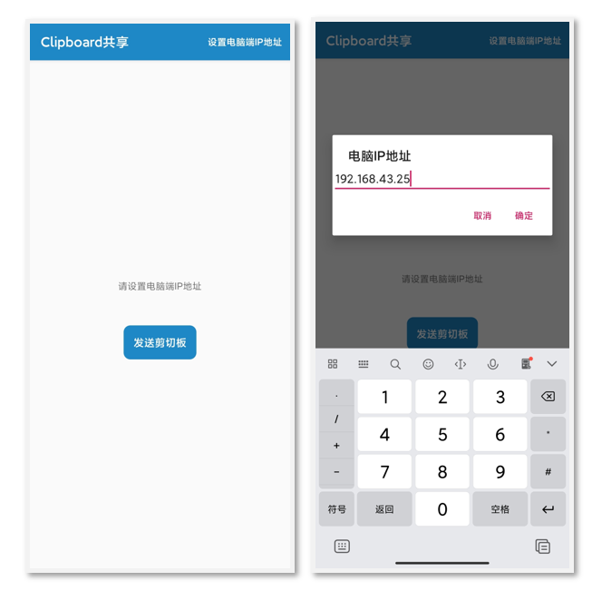

（4）复制Android手机端的任意内容  
（5）关闭电脑端**防火墙**  
（6）点击发送剪切板  
（7）服务器端（即电脑端）接收到客户端（即手机端）消息，在电脑端左击鼠标，点击粘贴，成功粘贴手机端的复制的内容
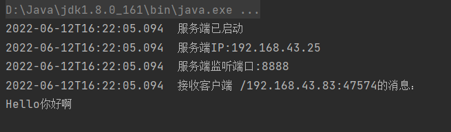
### 3.3关键代码及注解
#### **3.3.1 服务器端**
- 建立socket连接  
&emsp;&emsp;服务器端建立ServerSocket通信，与8888号端口绑定，并等待客户端请求。
```java
import java.net.ServerSocket;
private static ServerSocket socket;
    static {
        try {
            socket = new ServerSocket(8888);
        } catch (IOException e){
            e.printStackTrace();
        }
    }
```
- 监听客户端的连接  
&emsp;&emsp;服务器端采用accept()方法监听客户端的连接请求，一旦获得请求后，与客户端建立Socket连接，并接收客户发送的数据。
```java
private static void ListenClientConnect()
    {
        while (true)
        {
            Socket clientSocket = null;
            try {
                clientSocket = socket.accept();
            } catch (IOException e) {
                e.printStackTrace();
            }
            Socket finalClientSocket = clientSocket;
        }
    }
```
- 接收客户端发送的数据  
&emsp;&emsp;采用getInputStream()方法得到一个输入流，即客户端发送到服务器端的数据流，采用readLine()方法读取数据转换为字符串类型；采用getOutputStream()得到一个输出流，发送给客户端数据。
```java
private static void ReceiveMessage(Socket clientSocket) throws IOException {
        Socket myClientSocket =clientSocket;
        while (true)
        {
            try
            {            
                //读取Client的消息
                BufferedReader br = new BufferedReader(new InputStreamReader(myClientSocket.getInputStream(), "utf-8"));
                String data = br.readLine();
                System.out.println(dt.toString() + "  接收客户端 "+myClientSocket.getRemoteSocketAddress().toString()+"的消息：\n"+ data);
                //将客户端复制的内容设置到系统的剪切板
                setClipboardString(data);
                //给Client端返回信息
                String sendStr = "已成功接到您发送的消息";
                BufferedWriter bw = new BufferedWriter(new OutputStreamWriter(myClientSocket.getOutputStream(),"utf-8"));
                bw.write(sendStr);
                //关闭Socket,释放资源
                myClientSocket.close();
                new Scanner(System.in).nextLine();
            }
            catch (RuntimeException ex)
            {
                System.out.println(ex.getMessage());
                myClientSocket.close();
                break;
            }
        }
    }
```
- 将客户端发送的数据设置到系统剪切板  
&emsp;&emsp;采用Toolkit.getDefaultToolkit().getSystemClipboard()方法获取系统剪切板；采用StringSelection()方法封装文本内容；采用setContents()方法将文本内容设置到系统剪切板。
```java
import java.awt.datatransfer.Clipboard;
import java.awt.Toolkit;
import java.awt.datatransfer.Transferable;
import java.awt.datatransfer.StringSelection;
public static void setClipboardString(String text) {
        Clipboard clipboard = Toolkit.getDefaultToolkit().getSystemClipboard();
        Transferable trans = new StringSelection(text);
        clipboard.setContents(trans, null);
    }
```
#### **3.3.2 客户端**
- 设置服务器端IP地址  
&emsp;&emsp;在Android客户端设置服务器端的IP地址，以便后续客户端和服务端建立连接。
```java
public boolean onOptionsItemSelected(MenuItem item) {
        if (item.getItemId() == android.R.id.home) {
            finish();
        } else if (item.getItemId() == R.id.set) {
            AlertDialog.Builder builder = new AlertDialog.Builder(this);
            builder.setTitle("电脑IP地址");
            EditText editText = new EditText(this);
            editText.setHint("请输入电脑端IP地址");
            builder.setView(editText);
            builder.setPositiveButton("确定", (dialogInterface, i) -> {
                SharedPreferences.Editor editor = sp.edit();
                host = editText.getText().toString();
                if (!host.equals("")){
                    editor.putString("host", host);
                    editor.apply();
                    infoTv.setText("电脑端：" + host + ":" + PORT);
                }else {
                    showToast("IP地址为空，请重新输入");
                }
            });
            builder.create().show();
        }
        return super.onOptionsItemSelected(item);
    }
```
- 建立Socket连接和向服务器端发送数据  
&emsp;&emsp;客户端创建Socket连接，host和port分别为服务器端的IP地址和端口号。
```java
public static boolean sendSocket(String host, String content) {
        int port = PORT;
        Socket socket = null;
        OutputStream outputStream = null;
        try {
            socket = new Socket(host, port);
            outputStream = socket.getOutputStream();// 建立连接后获得输出流
            String message = content;
            outputStream.write(message.getBytes("UTF-8"));
            outputStream.close();
            socket.close();
        } catch (IOException e) {
            e.printStackTrace();
            return false;
        }
        return true;
    }
```
- 监听按钮点击事件,获取系统剪切板数据发送至服务器端   
&emsp;&emsp;一旦发生按钮点击事件，Android客户端便获取系统剪切板的数据，将其转换为字符串类型，调用以上sendSocket()方法将客户端的剪切板数据发送给服务器端，并返回发送是否成功的结果。
```java
sendBt.setOnClickListener(view -> new Thread(() -> {
            ClipboardManager clipboard = (ClipboardManager) getSystemService(Context.CLIPBOARD_SERVICE);
            ClipData clipData = clipboard.getPrimaryClip();
            String clipStr = "";
            if (clipData != null && clipData.getItemCount() > 0) {
                clipStr = clipData.getItemAt(0).getText().toString();
            }
            if (sendSocket(host, clipStr)) {
                handler.post(() -> Toast.makeText(MainActivity.this, "发送成功", Toast.LENGTH_SHORT).show());
            } else {
                handler.post(() -> Toast.makeText(MainActivity.this, "发送失败", Toast.LENGTH_SHORT).show());
            }
        }).start());
```
### 3.4单元测试
#### **3.4.1 服务器端**
- getLocalIP()测试   
&emsp;&emsp;通过cmd命令行窗口，输入ipconfig命令，获取本地IP地址，判断与调用ClipboardServer类中的GetLocalIP()方法的结果是否一致；经单元测试，二者结果一致，该GetLocalIP()方法通过单元测试。
```java
void getLocalIP() {
        String LoaclIp = this.clipboardServer.GetLocalIP();
        assertEquals("192.168.166.129",LoaclIp);
    }
```
- setClipboardString()测试  
&emsp;&emsp;调用ClipboardServer类中的setClipboardString()方法，将字符串"aaa"写入系统剪切板中；再通过getContents()方法读取剪切板内容，判断与写入的字符串内容是否一致；经测试，二者结果一致，该setClipboardString()方法通过单元测试。
```java
void setClipboardString() {
        this.clipboardServer.setClipboardString("aaa");
        // 获取剪贴板中的内容
        Clipboard clipboard = Toolkit.getDefaultToolkit().getSystemClipboard();
        Transferable trans = clipboard.getContents(null);
        String text="";
        try {
               text = (String) trans.getTransferData(DataFlavor.stringFlavor);
        } catch (UnsupportedFlavorException e) {
            e.printStackTrace();
        } catch (IOException e) {
            e.printStackTrace();
        }
        assertEquals("aaa",text);
    }
```
- ListenClientConnect()测试  
&emsp;&emsp;调用ClipboardServer类中的ListenClientConnect()方法，并判断返回结果是否为0，若为0则表示成功建立Socket连接，并接收到客户端发送的数据；连接客户端进行测试，该ListenClientConnect()方法通过单元测试。

```java
void ListenClientConnect() {
     assertEquals(0,this.clipboardServer.ListenClientConnect());
     }
```
## 四、持续集成

### 4.1 Github Actions简介
&emsp;&emsp;Github Actions 是 Github 提供的免费自动化构建实现，适用于持续集成和持续交付的场景，它具备自动化完成许多不同任务的能力，例如构建、测试和部署等等。

### 4.2 .yml 文件参数介绍
- 对于Github doc 里关于 Action 的基本的工作流 yml 文件，具体参数含义如下，对这些参数有基本的认识理解可以帮助我们看懂yml 文件：
    - `name`：这表示该工作流文件的名称，将在 Github 的 actions 选项卡作为名称显示，steps 里的 name 是可选项，主要是在日志中用来做标记的；
    - `on`：这将触发该工作流的事件名称，它可以包含事件列表，例如这里监听的事 push；
    - `**jobs`：**每个工作流会包含一个或多个 jobs ，在这里只有一个，主要是用于表示不同工作任务；
    - `Explore-GitHub-Actions` ：这是工作 ID，你也可以根据自己的需要命名，会在 action 的执行过程中显示；
    - `runs-on`：jobs 需要运行在虚拟机上，在这里中使用了 ubuntu-latest，当然你也可以使用windows-latest 或者 macos-latest；
    - `steps`：每个 jobs 可以将需要执行的内容划分为不同步骤；
    - `run`：用于提供执行命令，例如这里使用了echo 打印日志；
    - `uses` ：使用一些官方或者第三方的 actions 来执行，例如这里使用官方的 actionseckout@v2，它会check-out 我们的 repo ，之后工作流可以直接访问 repo 里的文件；

### 4.3 集成步骤

- 首先Github仓库创建目录`.github/workflows/`，然后在 `workflows` 文件夹里创建不同的 airdrop.yml 文件用于响应或者执行不同的事件：

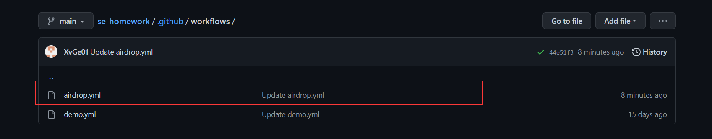

- 文件具体代码如下：

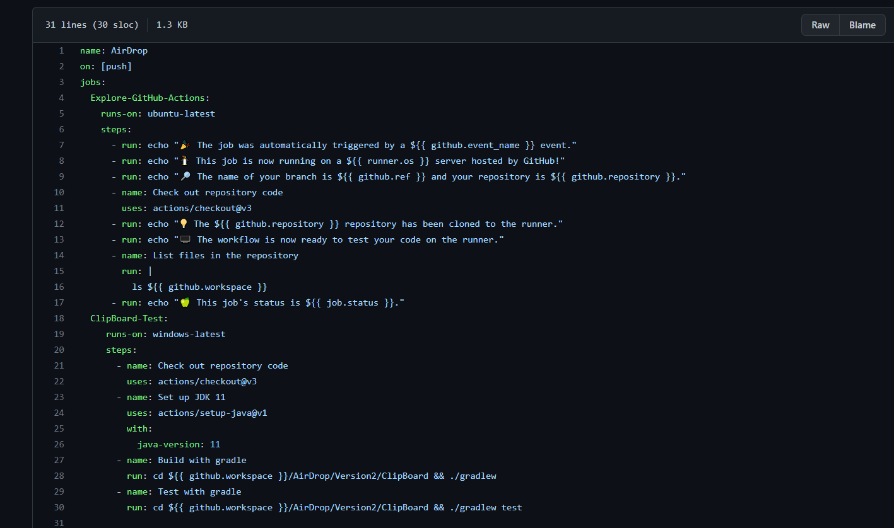

- 在 GitHub 仓库添加完对应的 .github/workflows/demo.yml 文件之后，以后每次 push 都可以触发 action 的自动执行，以此来完成可持续的自动集成和构建能力。

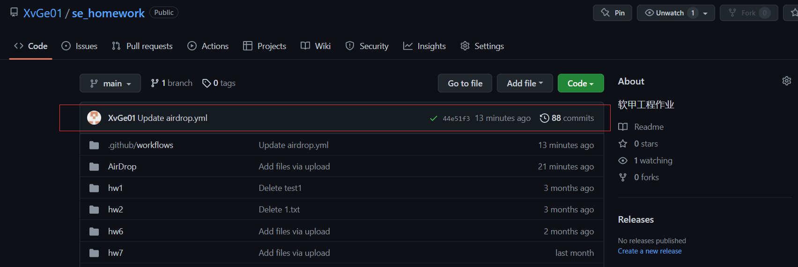
## 五、软件亮点
- 功能完善  
    实现了局域网内手机向电脑端传输文件、手机端复制电脑端粘贴的剪切板共享功能。
- 操作方便  
    当客户端和服务器端处于同一局域网下，手机端可以通过web网页直接上传文件；通过安装apk，下载"Clipboard共享"软件即可实现手机端复制、电脑端粘贴功能。
- 单元测试覆盖率高
   对软件的模块进行了单元测试，并通过测试，软件易维护、不易出错。
- 持续集成
    软件实现了持续集成，提高代码集成效率


