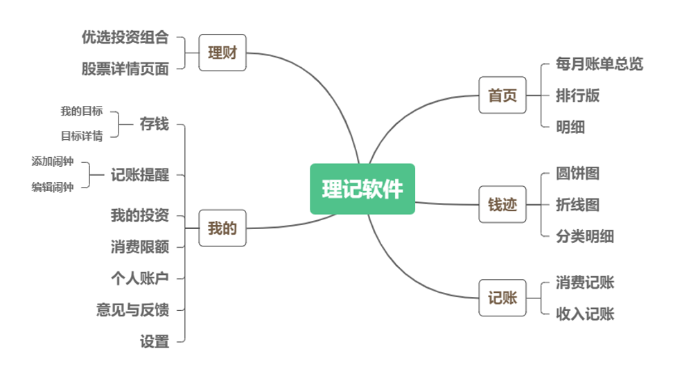
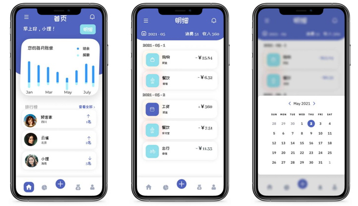
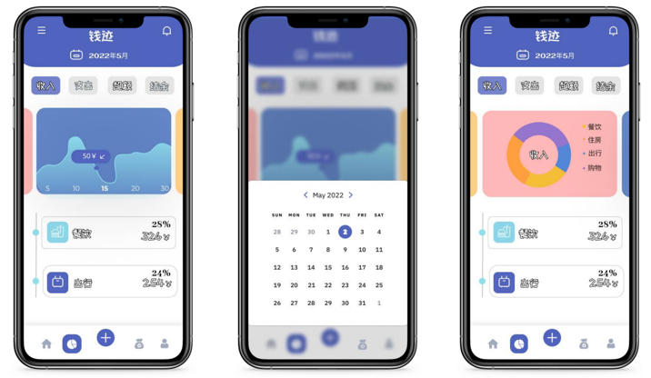
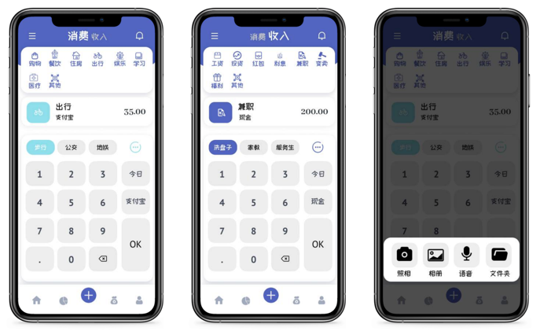
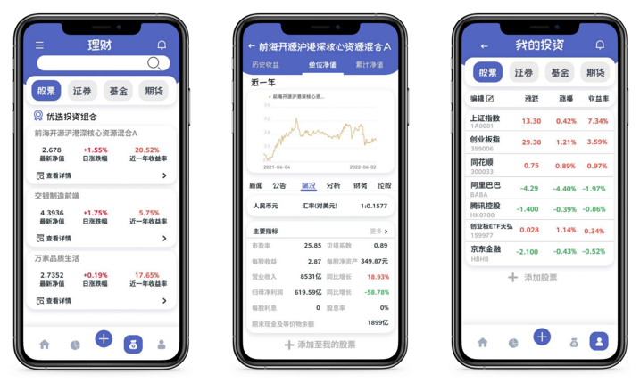
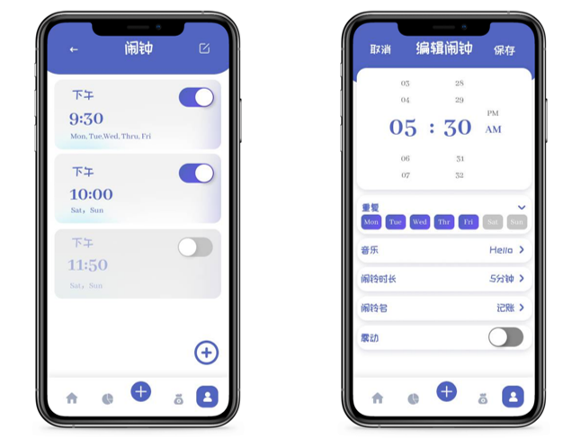
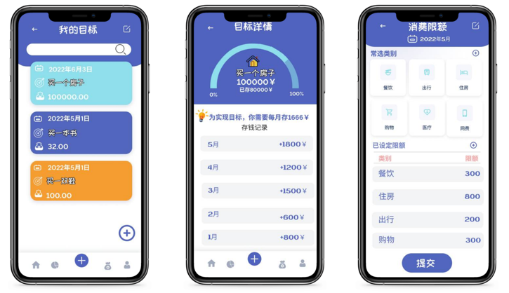
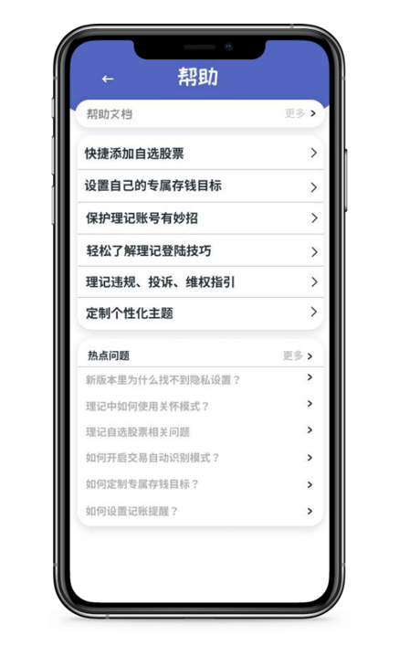

# “理记”软件设计文档

> **组员：徐婉婉 胥汶渲 李文豪 梁昊杨**

## 一、Logo设计

- 设计理念

          理记app的logo采用简约风格设计，整体呈现圆形，中央为“理记”两个大字竖直排列，设计简单大方。背景为中国古代的串珠，此处指代算盘。算盘作为一种自中国古代便用来记账的辅助工具，在电脑普及之前在人们日常记账，甚至在银行等金融机构中也被广泛应用的计算工具，代表了该app记账与理财的主题。

## 二、软件总体架构图

        理记APP是我们小组设计的用于记账及理财，以便于进行个人财务管理、减少冲动消费、合理投资理财的APP，其共有首页、钱迹、记账、理财、我的五大板块组成，其总体架构如上图所示。

## 三、软件具体页面

### 3.1 欢迎及注册登录页面

- 欢迎页面

        上述是我们的欢迎页面，该页面中蕴含了我们软件的部分特性及功能，有助于用户初步了解理记软件。

- 登录注册页面

        在该部分，用户可以输入邮箱、密码进行注册，注册完成后即可根据注册信息进行登录。此外，在注册时软件会提示确认密码、以及对邮箱地址进行正确性监测，体现了UI设计的防错性原则；登陆时，软件将进行邮箱历史信息提示，体现了识别胜于回忆的设计原则。

### 3.2 首页及明细页面

        在首页用户可以看到自己的月份账单总览，包含其他用户的结余排行榜，以便于用户扩展、并可以通过排行的方式激励用户合理消费。从首页可以进入明细页面，选择查看具体日期的记账明细，查询明细灵活高效。

### 3.3 钱迹

        钱迹页面可以对具体月份的收入、支出、超额、结余情况进行图表溯源，包含折线图、圆饼图等可视化图表，统计各类别占比明细，页面美观简洁，查询灵活高效。

### 3.4 记账

        记账页面中可对消费和收入进行按类别记账，同时提供了语音输入、图像识别等不同记账方式，此外，可在后续的设置页面中开启交易自动识别模式，当进行手机支付时自动生成账单信息。页面简洁美观，风格统一，提供多种记账方式，灵活高效。

### 3.5 理财 

        理财页面中可以获取软件提供的优选投资组合推荐、搜索理财产品，还可以查看理财产品详情，进入具体股票、基金等理财产品界面，对于理想的理财产品可进行自选，并添加和编辑自选产品，体现了用户可控性；自选的产品可在“我的投资”页面中查看，在该页面中还可以查看用户自身投资和收益率等信息，该部分页面的设计遵循灵活高效的理念。

### 3.6 我的

        “我的”页面包含个人账户、我的投资等众多子功能页面的入口，子页面中提供了编辑个人信息，设置软件主题、语言、模式等基本功能，用户可选择开通会员，享受开通自动识别记账、定制私人主题等专属福利。页面简洁清晰，方便用户完成各种软件中的个性化操作。

- 我的————记账提醒页面

        通过“我的”页面，设置记账提醒，进入具体页面后可以设置定时闹钟，提醒用户记录每天的花销和收入。

- 我的————存钱、消费限额

        进入“存钱”页面可添加存钱目标，卡片式展示用户设定的存钱目标，同时，可进一步查看目标详情；在“消费限额”页面，可以设定各类别的消费限额，有效节流，页面设计遵循亲密设计原则；此外，添加和编辑存钱目标体现了用户可控性，软件还可进行常选消费类别提示，表明了设计的识别胜于回忆原则。

- 帮助页面

        用户可通过“设置”页面中进入“帮助”页面，“帮助”页面中提供了主要软件功能的操作文档，以及用户反馈主要问题的相关解答，进一步帮助用户快速上手该软件。

