# Python格式化工具 ―― isort
## 一、简介
&emsp;&emsp;**isort**用于按字母顺序对代码中的`import`进行排序，并自动按导入包的类型进行分隔，一般包类型分为以下三种类型：
1. **标准库包**（*python自带的*）
2. **第三方包**（*需要pip install安装的*）
3. **本地包**（*自己本地写的*）

&emsp;&emsp;简而言之，**isort**是一个功能强大且实用的用于使`import`列表更美观的python工具包,可以把我们代码中的`import`部分分类、排序，实现格式化，优化统一代码风格，将大量的`import`结构转成非常适合阅读的排版，利于团队协作和代码维护。它为各种编辑器提供了命令行程序、Python库和插件，以快速对所有导入进行排序。需要Python3.6及以上版本，但也支持Python2。
## 二、示例
&emsp;&emsp;接下来我们以老师所给代码为例展示**isort**的功能：
- 使用**isort**格式化前：
```
from my_lib import Object

import os

from my_lib import Object3

from my_lib import Object2

import sys

from third_party import lib15, lib1, lib2, lib3, lib4, lib5, lib6, lib7, lib8, lib9, lib10, lib11, lib12, lib13, lib14

import sys

from __future__ import absolute_import

from third_party import lib3

print("Hey")
print("yo")
```
- 使用**isort**格式化后：
```
from __future__ import absolute_import

import os
import sys

from third_party import (lib1, lib2, lib3, lib4, lib5, lib6, lib7, lib8,
                         lib9, lib10, lib11, lib12, lib13, lib14, lib15)

from my_lib import Object, Object2, Object3

print("Hey")
print("yo")
```
&emsp;&emsp;通过上述实例可以看出，经过 **isort** 格式化后的`import`代码更加条理清楚，美观工整。
## 三、安装
&emsp;&emsp;安装方法十分简单，只需在命令行使用```pip install isort```命令即可,根据 python 版本(系统使用的是 python2 还是 python3)的不同选择使用`pip`或`pip3`：


&emsp;&emsp;也可以根据自身需求指定 **isort** 的版本，相应代码为：
```
pip install isort[requirements_deprecated_finder]
```
## 四：isort在不同环境中的使用
### 4.1 命令行使用
- 基本语法

```
isort 文件名.py
```
- 运行结果展示

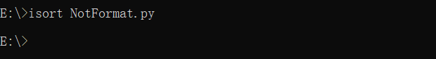

- 仅查看 isort 将做出的变更，但并不应用

```
isort 文件名.py --diff
```

- 运行结果展示

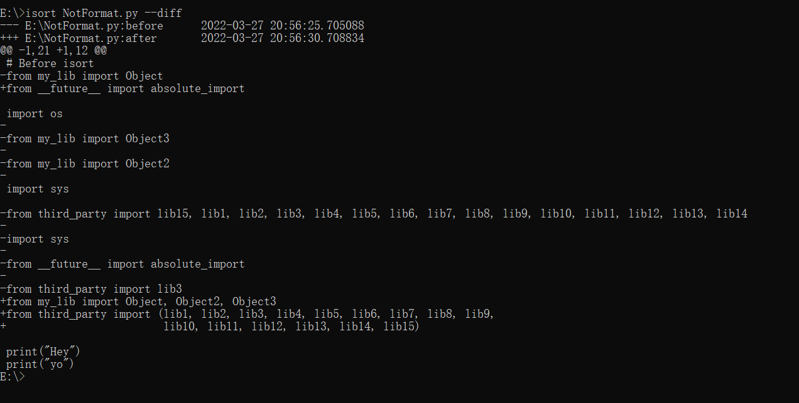

### 4.2 python环境中使用

- 基本语法
```
import isort

isort.file("文件名.py")
```
- 运行结果展示

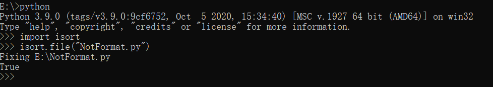

### 4.3 在VsCode中使用

- 打开py文件，点击右键

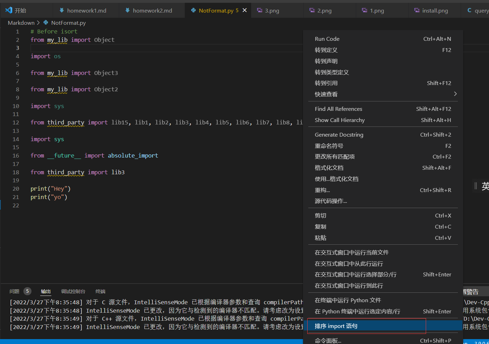

- 运行结果展示

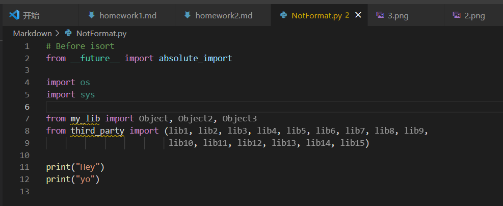

### 4.4 在PyCharm中使用

- 在命令行窗口使用``` where isort```确认isort工具包的安装位置


- 在PyCharm的外部工具中添加isort
     
      依次点击File -> Settings -> Tools -> External Tools
      
      创建工具：
            名称：isort
            描述：说明文字，不是必须的
            程序：isort的安装位置
            参数：$FilePath$
            工作目录：选择一个工作目录即可

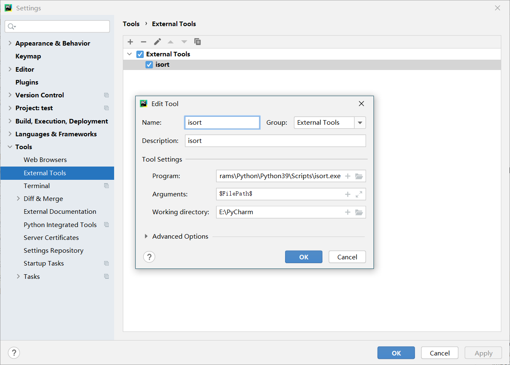

- 在已经打开的代码编辑界面鼠标右键，找到External Tools -> isort，点击即可。

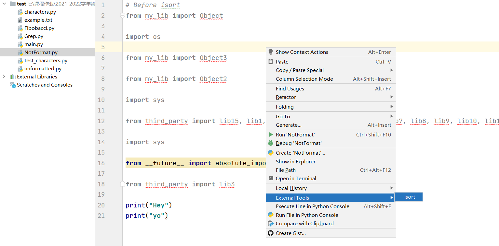

- 运行结果展示

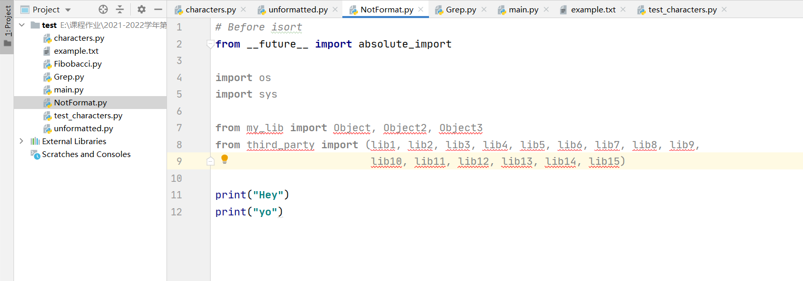

## 五：isort的详细使用

### 5.1 添加/移除 Imports

#### 5.1.1 向文件中添加一个 import

- 向指定文件中添加一个 import：

```
isort -a "from __future__ import print_function" 文件名.py
```
- 运行结果展示

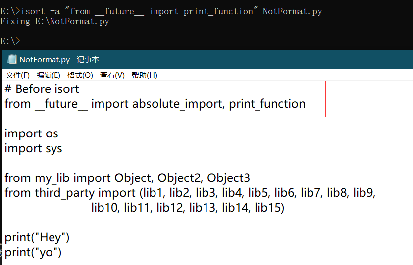

- 仅向已有import的文件中添加一个 import：

```
isort -a "from __future__ import print_function" --append-only 文件名.py
```
- 运行结果展示(对已有import的文件执行该命令)：

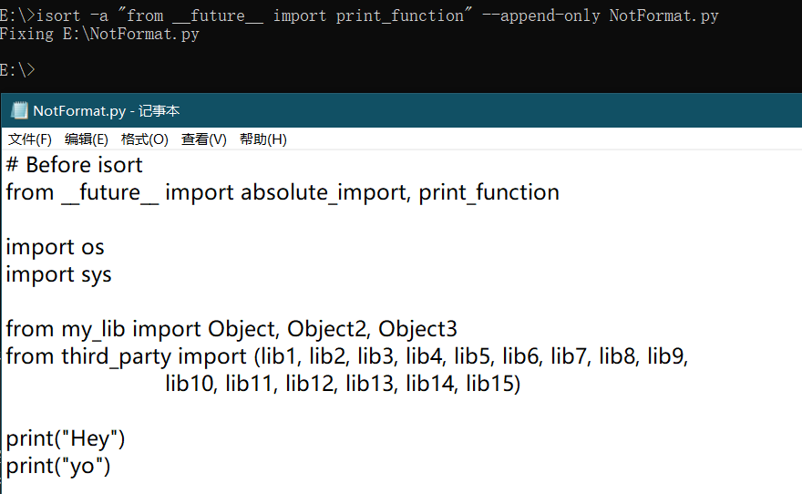

- 运行结果展示(对没有import的文件执行该命令)：

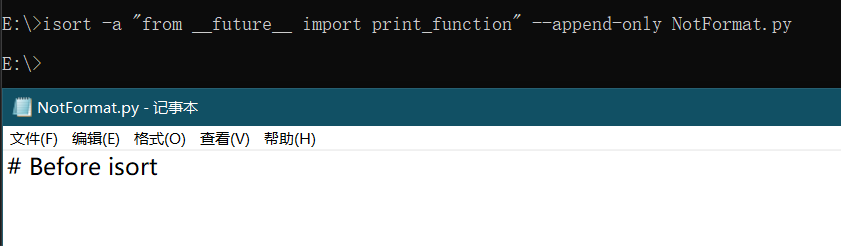

&emsp;&emsp;由此可见，该命令只在向已有import的文件中添加 import 时发挥作用。
#### 5.1.2 从文件中移除一个import

- 命令行用法：
```
isort --rm "os" 文件名.py
```

- 运行结果展示

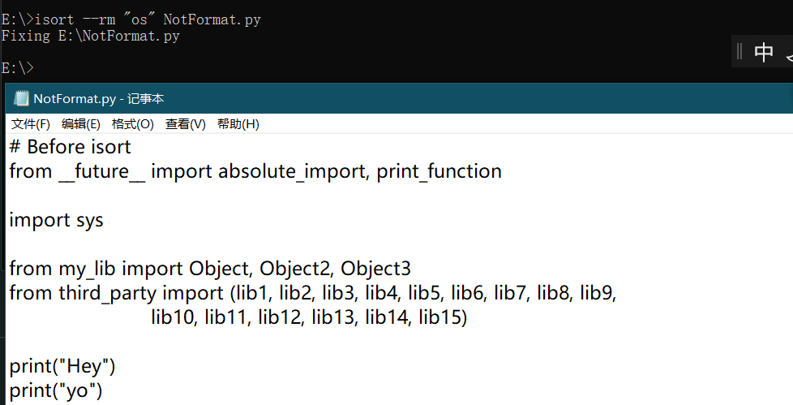

> 更多详细细节见[官方文档](https://link.zhihu.com/?target=https%3A//pycqa.github.io/isort/docs/configuration/add_or_remove_imports.html)

### 5.2 命令行选项

- isort 的命令行选项非常多，可以通过```isort --help```命令查看:

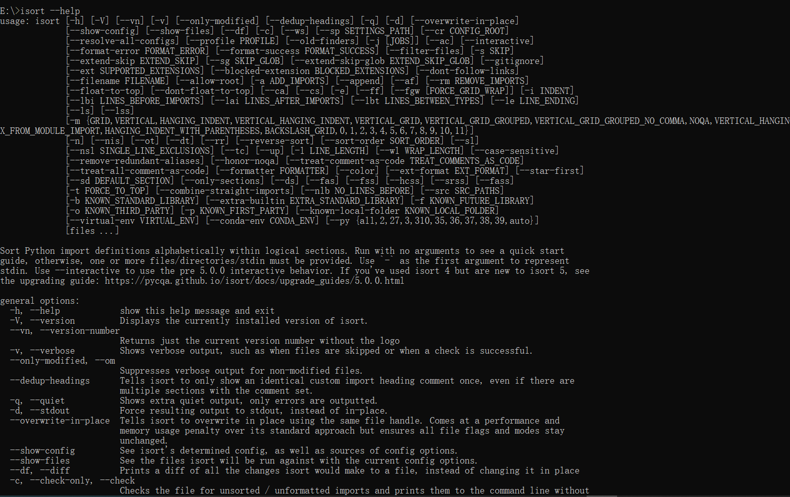

- 这里列举一些```isort --help```返回的帮助文档中的 general options 部分的内容：
```
general options:
  -h, --help            显示此帮助信息并退出

  -V, --version         显示当前安装的 isort 版本

  --vn, --version-number
                        返回仅有当前版本数字而没有 logo 的版本信息

  -v, --verbose         显示详细输出，例如跳过文件或检查成功

  --only-modified, --om
                        禁用关于未修改文件的详细输出

  --dedup-headings      告知 isort 只显示一次相同的自定义 import 标题注释，
                        即使有多个部分设置了注释组

  -q, --quiet           显示更少的输出，仅输出错误信息

  -d, --stdout          强制将结果输出至 stdout 标准输出，而不是就地更改

  --overwrite-in-place  告知 isort 使用相同的文件句柄就地覆盖重写
                        与标准方法相比，性能和内存使用情况会有所下降，但可确保所有
                        文件标志和模式保持不变

  --show-config         查看 isort 的确定配置，以及配置选项的来源

  --show-files          查看在当前选项下，哪些文件会被 isort 处理

  --df, --diff          显示 isort 将对一个文件做出的所有更改的 diff ，而不是就地更改

  -c, --check-only, --check
                        检查文件中是否存在未排序/未格式化的 import 并将它们打印到命令行
                        而不修改文件。当没有任何变化时返回 0，当文件被重新格式化时返回 1

  --ws, --ignore-whitespace
                        当使用了 --check-only 选项时，告知 isort 忽略空格的差异

  --sp SETTINGS_PATH, --settings-path SETTINGS_PATH, --settings-file SETTINGS_PATH, --settings SETTINGS_PATH
                        显式设置设置路径或文件，而不是根据文件位置自动确定。

  --profile PROFILE     用于配置的基本配置文件类型。配置文件包括：
                        black, django, pycharm, google, open_stack,plone, attrs, 
                        hug, wemake, appnexus。 以及任何共享的配置文件

  --old-finders, --magic-placement
                        使用依赖于环境自省魔术方法的旧的已弃用的查找器逻辑

  -j [JOBS], --jobs [JOBS]
                        要并行处理的文件数

  --ac, --atomic        如果生成的文件包含语法错误，则确保不会保存输出

  --interactive         告知 isort 以交互方式应用更改

  --format-error FORMAT_ERROR
                        覆盖用于打印错误的格式

  --format-success FORMAT_SUCCESS
                        覆盖用于打印成功的格式

```

> 完整的选项列表和说明可参考[官方文档](https://link.zhihu.com/?target=https%3A//pycqa.github.io/isort/docs/configuration/options.html)

### 5.3 API

&emsp;&emsp;除了强大的命令行界面， isort 还提供了一个完整的 Python API 。为使用 Python API ，import isort 然后调用所需要的函数。每个函数都有完整的类型提示，并且接收和返回的都是 Python 内置对象。

- 可在交互式解释器中使用help(isort)查看：

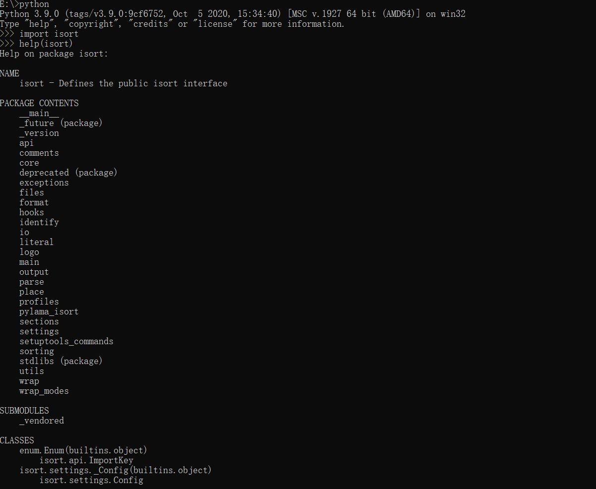

- 这里列举一些常用API：
```
isort.code  ： 接收一个包含代码的字符串，并在对 import 排序后返回它
isort.check_code ： 接收一个包含代码的字符串，如果所有 import 都已经正确排序，则返回 True ，否则返回 False
isort.stream ： 接收一个包含 Python 代码的输入流和一个输出流。向输出流输出已经对 import 进行了排序的代码。
isort.check_stream  : Python 代码的输出流，如果所有 import 都已经正确排序，则返回 True ，否则返回 False
isort.file ： 接收 Python 源文件的路径，并就地对 import 进行排序
isort.check_file ： 接收 Python 源文件的路径，如果所有 import 都已经正确排序，则返回 True ，否则返回 False
isort.place_module ： 将模块的名称作为字符串并返回为其确定的分类
isort.place_module_with_reason ： 将模块的名称作为字符串并返回为其确定的分类，并给出确定该分类的原因
```

> 更多API接口请查阅[官方文档](https://link.zhihu.com/?target=https%3A//pycqa.github.io/isort/docs/quick_start/3.-api.html)

>更多API使用细节参考[API参考文档](https://link.zhihu.com/?target=https%3A//pycqa.github.io/isort/reference/isort/api)

## 拓展
&emsp;&emsp;可以通过 Python 代码中的注释控制 isort 的行为。

1. ```isort: skip_file```
    - 作用：

          让 isort 跳过整个文件。
    - 实例：
      ```
      # !/bin/python3
      # isort: skip_file
      import os
      import sys
      ```
    - 提示：
          
          该代码应该尽可能合理地放在文件的最上面。由于 isort 使用的是流式架构，它可能在读到该行注释之前就已经完成了一些工作。一般情况下问题不大，但如果从命令行使用 --diff 或任何交互式选项，则可能造成混乱。
2. ```isort: skip```
   - 作用：

          如果将其放在与 import 语句同一行中，则 isort 将不会对此 import 进行排序。更具体地说，它会阻止 import 语句被 isort 识别为 import。因此，这一行将被视为代码并被推到文件导入部分的下方。
   - 实例：
        ```
          import b
          import a # isort: skip  ->该行的import不会参与排序，仍然位于import b之后
        ```
3. ```isort: off```
   - 作用：
          
         关闭 isort 解析。# isort: off 语句之后的每一行都将保持不变，直到 # isort: on 注释或文件结束。
   - 实例：
      ```
      import e
      import f

      # isort: off

      import b
      import a
      ```
4. ```isort: on```
    - 作用：
          
          重新打开 isort 解析。这仅在文件上文中存在 isort: off 注释时才有意义！这允许您在其他已排序的导入块周围存在未排序的导入块。
    
    - 实例：
      ```
      import e
      import f

      # isort: off

      import b
      import a

      # isort: on

      import c
      import d
      ```
5. ```isort: split```
    - 作用:
           
          告知 isort 当前排序部分已完成，所有未来的 import 都属于新的排序分组。
    - 实例：
      ```
      import e
      import f

      # isort: split

      import a
      import b
      import c
      import d
      ```
      
> 更多isort使用方法见[官方文档](https://pycqa.github.io/isort/index.html)

