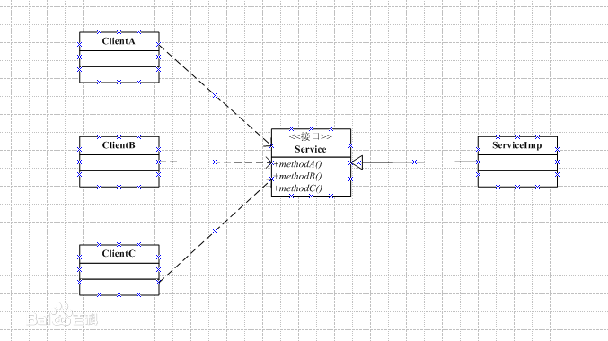
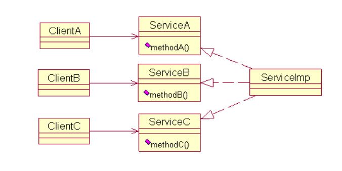

# SOLID之接口分离原则(ISP)
## 一、定义
&emsp;&emsp; **接口分离原则** （***Interface Segregation Principle, ISP***）指在设计时采用多个与特定客户类有关的接口比采用一个通用的接口要好。即，一个类要给多个客户使用，那么可以为每个客户创建一个接口，然后这个类实现所有的接口；而不要只创建一个接口，其中包含所有客户类需要的方法，然后这个类实现这个接口。简而言之，使用方不应该依赖于它不使用的方法，不建立庞大臃肿的接口，应尽量细化接口，接口中的方法应该尽量少，多个特定的客户端接口要好于一个通用性的总接口。*（当然，接口的粒度也不能太小，如果过小，则会造成接口数量过多，使设计复杂化。）*
## 二、作用
&emsp;&emsp;**ISP**主要用于处理**胖接口**（***fat interface***）所带来的问题。如果类的接口定义暴露了过多的行为，则说明这个类的接口定义内聚程度不够好。换句话说，类的接口可以被分解为多组功能函数的组合，每一组都服务于不同的客户类，而不同的客户类可以选择使用不同的功能分组。

&emsp;&emsp;这里，我们用更加通俗的语言解释**ISP**所发挥的作用：**ISP**原则是用来处理胖接口或胖基类的，通常情况下接口或类中包含了繁多方法的接口称为胖接口或胖基类。使用方在使用此类接口的时候，会发现自己没有必要实现某个方法，但由于在胖接口中存在，自己不得不实现一个，要么是空方法，要么抛出异常以表明自己不支持。这时候就需要**ISP**原则出场了，它指导你将接口划分成更小的粒度，使用方只需要实现自己需要的接口即可，而不用继承胖接口导致不得不实现胖接口交代下来的任务。
## 三、图示
- 未使用**ISP**的设计：



&emsp;&emsp;没有使用接口分离原理的设计如上图所示，存在以下问题：如果Client A类需要改变所使用的Service接口中的方法，那么不但要改动Service接口和ServiceImp类，还要对ClientB类和ClientC类重新编译。也就是说，对ClientA的修改会影响ClientB和ClientC，因此应对其进行修改。

- 使用**ISP**的设计：



&emsp;&emsp;如上图所示，每个客户类都有一个专用的接口，这个接口中只声明了与这个客户类相关的方法，而ServiceImp类实现了所有的接口。如果ClientA要改变它所使用的接口中的方法，只需改动ServiceA接口和ServiceImp类即可，ClientB和ClientC类不受影响，故采用的是接口分离原则。
## 四、示例

&emsp;&emsp;假设需求要求我们做一个二手书设计，要求我们记录书的基本信息，收购的基本信息，以及二手书的鉴定信息等信息。

### 4.1 设计的接口如下：

```
public interface Book {
    public String isbn();
    public String author();
    public Date publishDate();
    public PublisherInfo publisher();
    public PurchaseInfo purchaseInfo();
    public IdentificationInfo identificationInfo();
}
```
### 4.2 接口工作良好，很好的支持了网站的运行。但由于业务的变化，网站现在不仅仅要卖二手书了，还要卖新书。因此需要对设计进行修改以满足现实需求。

- 不符合ISP的设计：

      由于此时只是缺少了收购信息和鉴定信息，但是新书本质上还是书，因此我们直接实现了 Book 接口来卖新书。 

      public abstract class NewBook implements Book {
            public PurchaseInfo purchaseInfo() {
                  return null;
            }
            public IdentificationInfo identificationInfo() {
                  return null;
            }
      }

      此时，看起来所有的新书都使用NewBook接口，改动也很小就支持了新书的销售，很美好。但是实际上这个设计就违反了 ISP 原则，Book 强制所有的书都必须有收购信息和鉴定信息，但新书却并没有这两项，将新书实现 Book 接口强制新书也必须要有这两项信息，无奈只能使用折中办法返回null。

- 修正：

      我们需要将收购信息和鉴定信息单独拆到一个接口中，二手书的实现继承这个接口，而新书的实现不继承这两个接口。

      public interface Book {
            public String isbn();
            public String author();
            public Date publishDate();
            public PublisherInfo publisher();
            public PurchaseInfo purchaseInfo();
            public IdentificationInfo identificationInfo();
      }
 
      public interface SecondHand {
            public PurchaseInfo purchaseInfo();
            public IdentificationInfo identificationInfo();
      }

      接口拆分成这样已经满足网站的要求了，如果后面网站发展越来越大，鉴定成本不可承受时，有些书籍不作鉴定直接入库，这时我们就需要将 SecondHand 接口再拆分成两个接口，将收购信息和鉴定信息分离开来，不作耦和。
 
## 五、好处
&emsp;&emsp;综上所述，**ISP**原则能够避免同一个接口里面包含不同类职责的方法，使接口责任划分更加明确，符合高内聚低耦合的思想。

## 六、与单一职责原则（SRP）的比较
&emsp;&emsp;**ISP**原则和我们课上所学的**SRP**原则看起来非常相似，但是在某些方面还是有所区别的。单一职责原则倾向于设计视角，接口分离原则倾向于实现视角。即**SRP**原则说的是一个类只能有一个改变的理由，**ISP** 原则指的是使用方不应该依赖它不使用的方法。有的设计符合 **SRP** 原则却并不符合 **ISP** 原则。

- 举一个例子：

      正常的 Stack 都有 push pop 方法，如果使用方有一个使用场景，只能使用 push， 不能使用 pop, 那么使用方就不能继承 Stack 来实现自己的功能，与 **ISP** 原则相悖。但是原始的 Stack 设计是完全符合 SRP 原则的，push 与 pop 就是它自己的职责。

&emsp;&emsp;从这个例子可以看出，**ISP** 原则不仅仅能指导我们分离接口，还能帮助判断一个类的继承是不是合理的。

> 更多接口分离原则详解见[相关文档](https://blog.csdn.net/chenweiyu11962/article/details/102618165)

