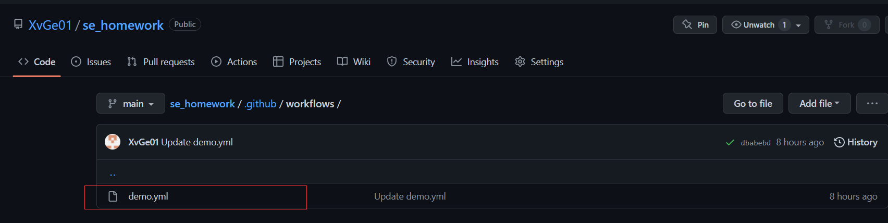
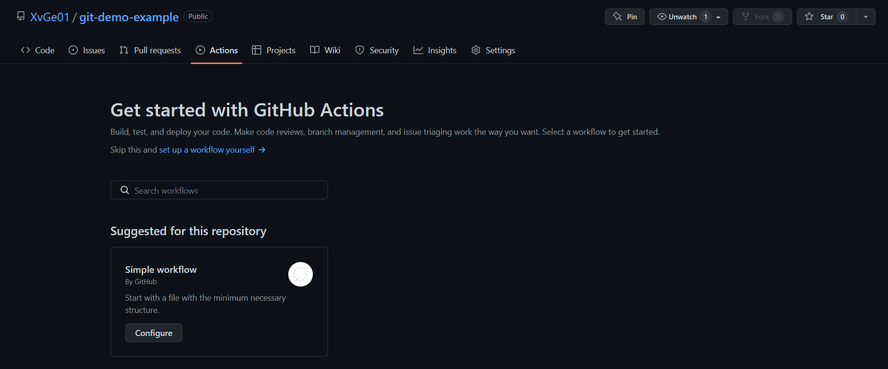
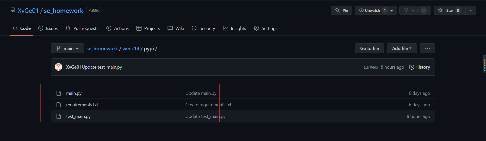
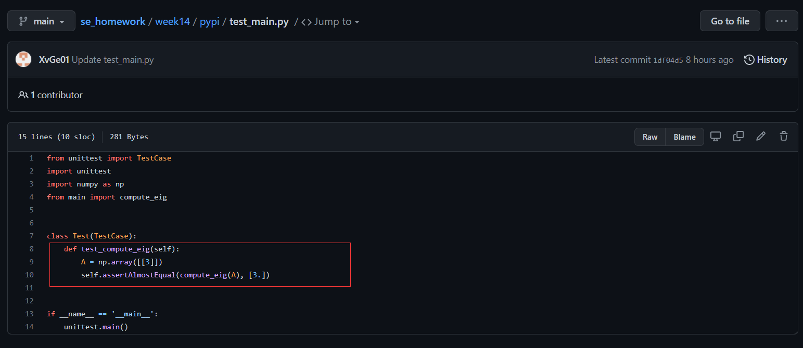
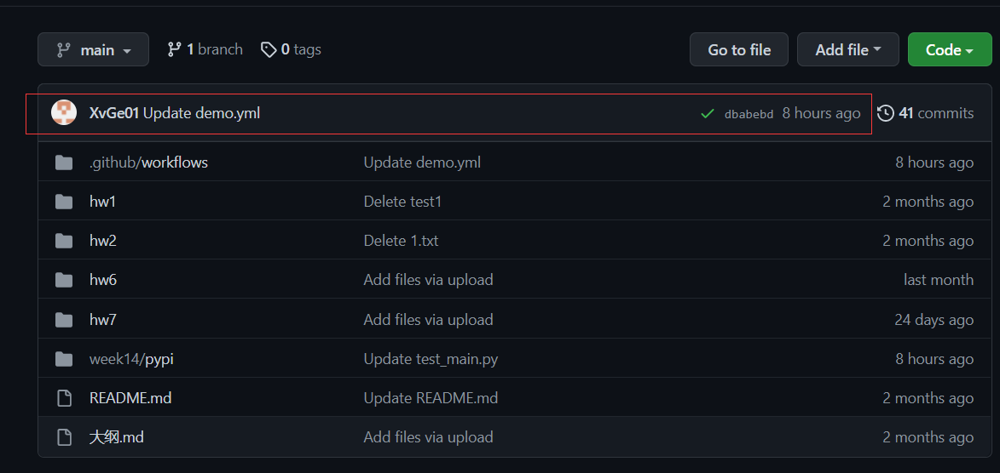
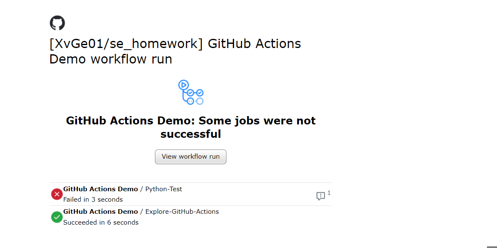
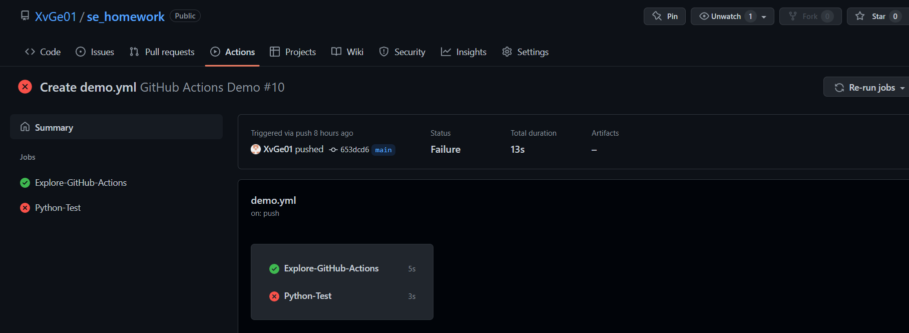
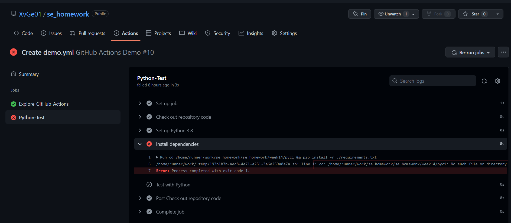

# 使用 Github Action对仓库进行简单的构建、测试
## 简介
&emsp;&emsp;Github Actions 是 Github 提供的免费自动化构建实现，适用于持续集成和持续交付的场景，它具备自动化完成许多不同任务的能力，例如构建、测试和部署等等。

## .yml 文件参数介绍
- 对于Github doc 里关于 Action 的基本的工作流 yml 文件，具体参数含义如下，对这些参数有基本的认识理解可以帮助我们看懂yml 文件：
    - `name`：这表示该工作流文件的名称，将在 Github 的 actions 选项卡作为名称显示，steps 里的 name 是可选项，主要是在日志中用来做标记的；
    - `on`：这将触发该工作流的事件名称，它可以包含事件列表，例如这里监听的事 push；
    - `**jobs`：**每个工作流会包含一个或多个 jobs ，在这里只有一个，主要是用于表示不同工作任务；
    - `Explore-GitHub-Actions` ：这是工作 ID，你也可以根据自己的需要命名，会在 action 的执行过程中显示；
    - `runs-on`：jobs 需要运行在虚拟机上，在这里中使用了 ubuntu-latest，当然你也可以使用windows-latest 或者 macos-latest；
    - `steps`：每个 jobs 可以将需要执行的内容划分为不同步骤；
    - `run`：用于提供执行命令，例如这里使用了echo 打印日志；
    - `uses` ：使用一些官方或者第三方的 actions 来执行，例如这里使用官方的 actions/checkout@v2，它会check-out 我们的 repo ，之后工作流可以直接访问 repo 里的文件；

## 实验步骤
- 首先Github仓库创建目录`.github/workflows/`，然后在 `workflows` 文件夹里创建不同的 .yml 文件用于响应或者执行不同的事件。比如 `git push` 、`pull request` 等, 这里使用老师提供的示例文件[https://github.com/ChenZhongPu/swufe-se/blob/main/.github/workflows/demo.yml](https://github.com/ChenZhongPu/swufe-se/blob/main/.github/workflows/demo.yml)：

    - 这里也可以通过点击仓库中的Action选项卡进行创建：

   

- 对于demo.yml文件中包含的python代码测试任务，我们须在创建`.github/workflows/demo.yml`目录文件之前在仓库中创建涉及到的`main.py`、`requirements`、`test_main.py`等相关文件：

- 这里，我们对`test_main.py`文件进行修改，将其改为正确的测试代码

- 在 GitHub 仓库添加完对应的 .github/workflows/demo.yml 文件之后，以后每次 push 都可以触发 action 的自动执行，以此来完成可持续的自动集成和构建能力。

    - 当代码测试失败时，用户将会收到相关提醒邮件：

    - 点击相关连接，可在 github 上查看具体执行结果：

